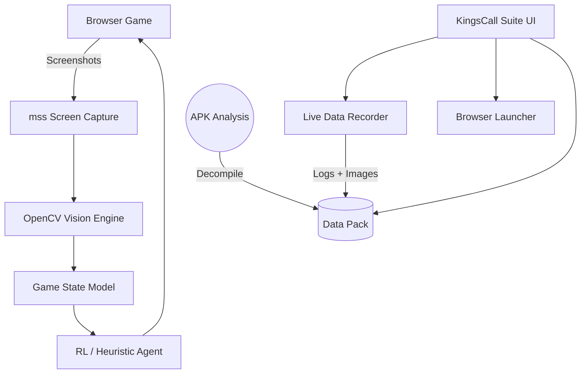

# KingsCall H5 — CardBot & Data Capture Suite

A modular automation, analysis, and data capture framework for **King's Call** (HTML5 browser version, APK reference build `1.1.7.0`).

> **Game context.** King's Call is the current name of a long-running browser CCG previously released as **Kings and Legends** (GameSpree/gamigo, 2012–2021) and **Rise of Mythos** (GameFuse/ChangYou, 2013–2019). The current version is operated by X Star Game Limited / Starlight Games on Steam (App 2674290), Google Play (`com.xstar.kingscall`), iOS (`id6753857798`), and HTML5 browser at xstargame.com. The H5 build runs on **separate servers from Steam** with its own card pool and balance — accounts and progress are not shared. See `research/` for the full history.

---

## Architecture Overview

This project provides a toolkit for interacting with the H5 game running in a browser, capturing real-time data, and analyzing statically extracted APK information.



## Setup & Installation

The project requires Python 3.9+ and is designed for Windows (for native browser launching and capture).

```bash
# 1. Activate the virtual environment
.venv\Scripts\activate

# 2. Install dependencies (if not already installed)
pip install mss opencv-python pillow
```

*(Note: The `cardbot` package implies a local installation. You can run all scripts as modules.)*

---

## Unified Capture Suite

A native Python dashboard merging all operational tools into a single interface.

**To launch the suite:**
```powershell
python -m cardbot.tools.kingscall_suite
```

### GUI Features
1. **Game Launcher:** Spin up 1 to 12 game windows via Microsoft Edge or Chrome. *Internet Explorer is no longer supported by Microsoft (retired June 15, 2022) and will not open the game on current Windows builds; legacy IE-launch code paths are kept only for archival reference.*
2. **Autologin:** Dynamically generates isolated Chrome Extensions for rapid, simultaneous instance logins.
3. **Login Fallback:** "Macro Login" button that simulates OS-level keyboard typing for 100% reliability if extensions are blocked.
4. **Safety Backups:** Integrated "Save/Load Backup" for your account credentials.
5. **Live Data Capture:** Background `SessionRecorder` periodically saves screenshots and logs events to `analysis/live_sessions/` *(directory is generated when the recorder runs; not committed to the repo).*
6. **APK Data Browser:** Explore decoded game tables (Equipment, Spells, Dungeons) natively in the tree view, once you have populated `analysis/kingscall_data_pack/` by running `cardbot.tools.extract_kingscall_data` against a decompiled `com.xstar.kingscall` APK.
7. **Session Viewer:** Summarize previous JSONL recording sessions.
8. **Runtime Status & Feedback:** Monitor bot instances in a web dashboard containing a live **Virtual Board** mirroring the bot's shadow state, along with a 1-click **Feedback Mechanism** to report vision errors to `data/feedback/`.

### Live Gameplay Insights
30-minute automated telemetry captures have produced the following baseline stats *(hardware-dependent; rerun on your own machine for accurate numbers)*:
- **Vision Log Rate:** Background CV holds a steady ~4 FPS tracking rate under load.
- **Phase Duration:** Approximately **67%** of all logged frames dwell in the "Player Turn" state, indicating significant idle time waiting for player action compared to swift enemy animation cycles.
- **Match Pacing:** Matches average roughly 16 full round-turn cycles per 30-minute block.

---

## APK Analysis Reference

These figures come from extracting the `1.1.7.0` APK bundle (`com.xstar.kingscall`) using `cardbot.tools.extract_kingscall_data`. The repo does **not** ship the APK or extracted output — you must produce them yourself; the resulting tree lands at `analysis/kingscall_data_pack/`.

| Property | Value |
|----------|-------|
| **Engine** | Cocos Creator 3.8.7 |
| **SDK** | Wancms SDK (WeChat / Alipay login, role/event tracking) |
| **Firebase** | Auth, Realtime DB, Analytics |
| **Hot-Update CDN** | `cdn.xstargame.com` |
| **Data Tables** | 215 JSON sheets, 31 CSVs (after extraction) |

### Game Data at a Glance (from APK extraction)

| Category | Count | Source File |
|----------|-------|-------------|
| Playable cards | **7,785** | `card.json` (4.9 MB) |
| Creature combat stats | **6,700** | `monster.json` (2.9 MB) |
| Skills / abilities | **552** | `Skill.json` (501 KB) |
| Status effects | **372** | `Status.json` (169 KB) |
| Compound effects | **2,649** | `Effect.json` (1.4 MB) |
| Race tags (incl. hybrids/sub-races) | **13** | Derived from card data |
| Gacha pools | **20+** | `kaibaoCard.json` |
| Guild skills | **200+** | `guildskill.json` |

> **Note on factions vs. race tags.** The player-facing faction roster is the original 7 (Humans, Elves, Halfbloods, Undead, Goblins, Ogres, Beasts) plus Outsiders, Dragons, Angels, and Demons added in later expansions, with Hybrids as a distinct synthesis category. The "13" figure above counts every race tag present in the card data, which includes sub-races and hybrid groupings.

### Damage Type Distribution
```
Physical  57.8%  ████████████████████████░░░░░░░░  3,873 creatures
Fire      10.6%  ████░░░░░░░░░░░░░░░░░░░░░░░░░░░░    709
Holy       7.2%  ███░░░░░░░░░░░░░░░░░░░░░░░░░░░░░    482
Arcane     7.6%  ███░░░░░░░░░░░░░░░░░░░░░░░░░░░░░    507
Frost      6.5%  ██░░░░░░░░░░░░░░░░░░░░░░░░░░░░░░    433
Lightning  6.3%  ██░░░░░░░░░░░░░░░░░░░░░░░░░░░░░░    421
Shadow     4.1%  █░░░░░░░░░░░░░░░░░░░░░░░░░░░░░░░    275
```

### Key Mechanics Discovered
- **Battlefield:** 4 lanes × ~12 squares deep. Creatures advance ~2 squares per turn; combat triggers when opposing creatures meet on the same column.
- **Classes:** 4 hero classes (Warrior, Ranger, Mage, Priest); each has its own exclusive skill-card pool.
- **Card Evolution:** 6-tier rarity (Common → Good → Rare → Epic → Legendary → Godlike), with Awakened as a post-Godlike upgrade. Fusion success decays exponentially (~3500 → 225) with tier.
- **Status Effects:** DoTs (Burning / Poison), controls (Freeze / Stun / Charm / Blind), stat mods (Weakened / Withered).
- **AOE Patterns:** 33+ geometry types (cones, adjacents, dashes, 2×3 areas).
- **Race Synergies:** Faction auras (e.g. "All friendly goblins gain 50% hand disruption").
- **Dragon Forms:** 5 wing variants (flight + element resistance), 5 scale variants (damage caps).
- **Pet System:** Companion skills, growth curves, trigger-based activation (launched in Kings Call September 2024, hero level 20+).
- **Guild Economy:** 200+ skills with exponential contribution scaling.

Detailed walkthroughs are available in `research/` and the project documentation.

---

## Engine Model: Simplification Note

The deterministic Python engine in `cardbot/engine/` is an intentional **simplification** of the live game. It models lanes as one-slot-per-side and resolves attacks directly to hero HP rather than simulating the 12-square corridor. This is sufficient for vision-driven mirroring, heuristic decision-making, and tabular Q-learning prototypes — not for ground-truth match simulation. Default board is 4 lanes (matching the live game); 2- and 3-lane modes are kept for unit-test ergonomics. See `cardbot/engine/lane.py` and `cardbot/engine/game_state.py` for details.

---

## Modular Framework

If you prefer terminal commands over the GUI, the modular framework is fully intact:

- **Launch 4 tiled bots:** `python -m cardbot.run_multi --instances 4 --rows 2 --cols 2 --mode observe`
- **Interactive calibration:** `python -m cardbot.tools.calibrate_capture --instances 4`
- **Web Status Dashboard:** `python -m cardbot.tools.status_ui`
- **Train Tabular Q-Agent:** `python -m cardbot.tools.train_q --episodes 5000`
- **Parse Session Scenarios:** `python -m cardbot.tools.session_to_scenarios cardbot/data/sessions`
- **Extract APK data pack:** `python -m cardbot.tools.extract_kingscall_data --apk-root <decompiled-apk>`

---

## Project Structure

```
cardbot/
├── main.py                 # End-to-end automation loop
├── run_multi.py            # Multi-instance launcher with grid tiling
├── agents/                 # Decision-making (heuristic, random)
├── capture/                # MSS screen capture wrapper
├── vision/                 # OpenCV pipeline (cards, lanes, turns, OCR)
├── engine/                 # Simplified deterministic game engine
├── controller/             # Win32 input + session logging + runtime status
├── environment/            # Gymnasium RL wrapper
├── tools/                  # GUI suite, recorder, calibration, training
└── data/                   # Cards, abilities, sessions, models

research/                   # Background research on the game (history, mechanics, meta)

analysis/                   # Generated by tools — not committed
├── kingscall_data_pack/    #   215 JSON tables + 31 CSVs from APK extraction
├── kingscall_apktool/      #   Decompiled APK resources
├── kingscall_jadx/         #   Decompiled Java sources
└── live_sessions/          #   Recording snapshots

docs/
└── index.html              # Project landing page
```

---

## Website

Open `docs/index.html` in a browser or deploy via GitHub Pages for the project landing page.
