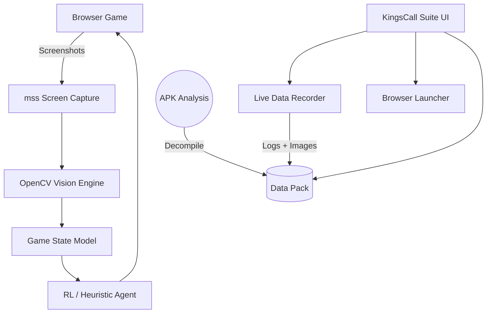

# KingsCall H5 — CardBot & Data Capture Suite

A modular automation, analysis, and data capture framework for **KingsCall H5** (v1.1.7.0).

---

## Architecture Overview

This project provides a robust toolkit for interacting with the game running in a browser, capturing real-time data, and analyzing statically extracted APK information.



## Setup & Installation

The project requires Python 3.9+ and is designed for Windows (for native IE/Edge launching and capture).

```bash
# 1. Activate the virtual environment
.venv\Scripts\activate

# 2. Install dependencies (if not already installed)
pip install mss opencv-python pillow
```

*(Note: The `cardbot` package implies a local installation. You can run all scripts as modules.)*

---

## Unified Capture Suite

A native Python dashboard merging all operational tools into a single interface.

**To launch the suite:**
```powershell
python -m cardbot.tools.kingscall_suite
```

### GUI Features
1. **Game Launcher:** Spin up 1 to 12 game windows instantly via Internet Explorer, Edge, or Chrome.
2. **Autologin:** Dynamically generates isolated Chrome Extensions for rapid, simultaneous instance logins.
3. **Login Fallback:** Includes a "Macro Login" button that simulates OS-level keyboard typing for 100% reliability if extensions are blocked.
4. **Safety Backups:** Integrated "Save/Load Backup" for your account credentials.
5. **Live Data Capture:** Background `SessionRecorder` periodically saves screenshots and logs events to `analysis/live_sessions/`.
6. **APK Data Browser:** Explore 215 fully decoded game tables (Equipment, Spells, Dungeons) natively in the tree view.
7. **Session Viewer:** Summarize previous JSONL recording sessions.
8. **Runtime Status & Feedback:** Monitor bot instances in a web dashboard containing a live **Virtual Board** mirroring the bot's shadow state, along with a 1-click **Feedback Mechanism** to report vision errors to `/data/feedback/`.

### Live Gameplay Insights
Recent 30-minute automated telemetry captures have surfaced several UX statistics:
- **Vision Log Rate:** Background CV holds a steady ~4 FPS tracking rate under load.
- **Phase Duration:** Approximately **67%** of all logged game frames dwell in the "Player Turn" state, indicating significant idle time waiting for player action compared to swift enemy animation cycles.
- **Match Pacing:** Games average roughly 16 full round-turn cycles per 30-minute block.

---

## APK Analysis Details

Extracted from the `1.1.7.0` APK bundle (`com.xstar.kingscall`):

| Property | Value |
|----------|-------|
| **Engine** | Cocos Creator 3.8.7 |
| **SDK** | Wancms SDK (WeChat/Alipay login, roles, tracking) |
| **Firebase** | Auth, Realtime DB, Analytics |
| **Hot-Update CDN** | `cdn.xstargame.com` |
| **Data Tables** | 215 JSON sheets, 31 CSVs in `analysis/kingscall_data_pack` |

### Game Data at a Glance

| Category | Count | Source File |
|----------|-------|-------------|
| Playable cards | **7,785** | `card.json` (4.9 MB) |
| Creature combat stats | **6,700** | `monster.json` (2.9 MB) |
| Skills / abilities | **552** | `Skill.json` (501 KB) |
| Status effects | **372** | `Status.json` (169 KB) |
| Compound effects | **2,649** | `Effect.json` (1.4 MB) |
| Races / factions | **13** | Derived from card data |
| Gacha pools | **20+** | `kaibaoCard.json` |
| Guild skills | **200+** | `guildskill.json` |

### Damage Type Distribution
```
Physical  57.8%  ████████████████████████░░░░░░░░  3,873 creatures
Fire      10.6%  ████░░░░░░░░░░░░░░░░░░░░░░░░░░░░    709
Holy       7.2%  ███░░░░░░░░░░░░░░░░░░░░░░░░░░░░░    482
Arcane     7.6%  ███░░░░░░░░░░░░░░░░░░░░░░░░░░░░░    507
Frost      6.5%  ██░░░░░░░░░░░░░░░░░░░░░░░░░░░░░░    433
Lightning  6.3%  ██░░░░░░░░░░░░░░░░░░░░░░░░░░░░░░    421
Shadow     4.1%  █░░░░░░░░░░░░░░░░░░░░░░░░░░░░░░░    275
```

### Key Mechanics Discovered
- **Card Evolution:** 6-tier quality system with exponential fusion success decay (3500 → 225)
- **Status Effects:** DoTs (Burning/Poison), controls (Freeze/Stun/Charm/Blind), stat mods (Weakened/Withered)
- **AOE Patterns:** 33+ geometry types (cones, adjacents, dashes, 2x3 areas)
- **Race Synergies:** Faction auras (e.g. "All friendly goblins gain 50% hand disruption")
- **Dragon Forms:** 5 wing variants (flight + element resistance), 5 scale variants (damage caps)
- **Pet System:** Companion skills, growth curves, trigger-based activation
- **Guild Economy:** 200+ skills with exponential contribution scaling

Detailed walkthroughs are available in the project documentation.

---

## Modular Framework

If you prefer terminal commands over the GUI, the modular framework is fully intact:

- **Launch 4 tiled bots:** `python -m cardbot.run_multi --instances 4 --rows 2 --cols 2 --mode observe`
- **Interactive calibration:** `python -m cardbot.tools.calibrate_capture --instances 4`
- **Web Status Dashboard:** `python -m cardbot.tools.status_ui`
- **Train Tabular Q-Agent:** `python -m cardbot.tools.train_q --episodes 5000`
- **Parse Session Scenarios:** `python -m cardbot.tools.session_to_scenarios cardbot/data/sessions`

---

## Project Structure

```
cardbot/
├── main.py                 # End-to-end automation loop
├── run_multi.py            # Multi-instance launcher with grid tiling
├── agents/                 # Decision-making (heuristic, random)
├── capture/                # MSS screen capture wrapper
├── vision/                 # OpenCV pipeline (cards, lanes, turns, OCR)
├── engine/                 # Deterministic game engine (state, combat, abilities)
├── controller/             # Win32 input + session logging + runtime status
├── environment/            # Gymnasium RL wrapper
├── tools/                  # GUI suite, recorder, calibration, training
└── data/                   # Cards, abilities, sessions, models

analysis/
├── kingscall_data_pack/    # 215 JSON tables + 31 CSVs from APK
├── kingscall_apktool/      # Decompiled APK resources
├── kingscall_jadx/         # Decompiled Java sources
└── live_sessions/          # Recording snapshots

docs/
└── index.html              # Project website
```

---

## Website

Open `docs/index.html` in a browser or deploy via GitHub Pages for the project landing page.
